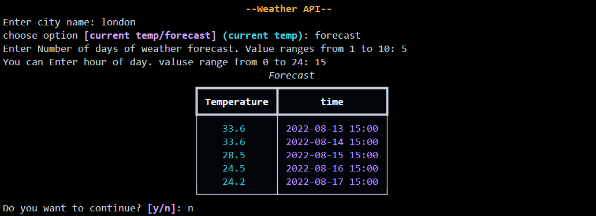

<h1><b>
terminal_weather_app
</b></h1>
A weather app in the terminal built using 
<a href="https://api.weatherapi.com">weatherapi</a>, python and <a href="https://github.com/Textualize/rich">rich</a>.

Showcase

